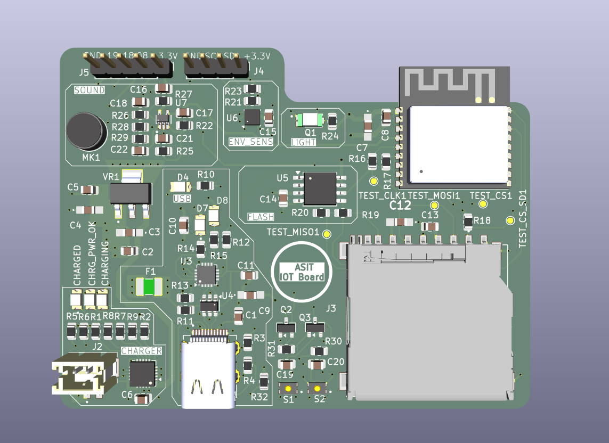

# 4-Layer IoT Telemetry Board

A custom 4-layer IoT Telemetry Board designed from scratch using KiCad. The board is built around an ESP32 and integrates environmental sensing, local data storage, USB connectivity, wireless communication, and battery charging and power management in a compact PCB.

## Project Overview

The goal of this project was to design a compact and reliable IoT hardware platform capable of collecting environmental data, processing it locally, storing telemetry data, and communicating wirelessly.

The project covers the complete PCB development workflow, from component selection and schematic design to PCB layout, verification, 3D inspection, and manufacturing file generation.

## 3D PCB View



## Key Features

### ESP32 Processing and Connectivity

The ESP32 is the main controller of the board and provides:

- Sensor data acquisition
- Local data processing
- Wi-Fi connectivity
- Bluetooth connectivity
- Communication with external peripherals

### Sensors

The board includes multiple sensing elements for environmental and acoustic monitoring:

- Microphone for sound sensing
- Humidity sensor for environmental monitoring
- Ambient light sensor for light-level measurement

### Data Storage

Two storage options are integrated into the board:

- Micro SD card for removable and higher-capacity data storage
- Flash memory for local non-volatile storage

### Power Management

The power section is based on the MCP73871 battery charging and power-management IC.

Main power features include:

- USB Type-C power input
- Battery charging
- Power-path management
- Battery-powered operation
- Dedicated 3.3 V regulation using an LM1117-3.3V regulator

### USB Type-C

A USB Type-C connector is included for power input and USB communication.

## PCB Stack-Up

The board uses a 4-layer PCB stack-up to improve power distribution, grounding, and routing flexibility.

| Layer | Purpose |
|---|---|
| Layer 1 | Signal |
| Layer 2 | Ground Plane |
| Layer 3 | Power Plane - 5 V and 3.3 V zones |
| Layer 4 | Signal |

The dedicated ground and power layers provide continuous return paths and simplify power distribution across the board.

## Communication Interfaces

| Interface | Purpose |
|---|---|
| I2C | Sensor and peripheral communication |
| SPI | SD card, flash memory, and other peripherals |
| USB | Power, programming, and communication |
| Wi-Fi | Wireless connectivity |
| Bluetooth | Short-range wireless connectivity |

## System Architecture

```text
                         +---------------------+
                         |     USB Type-C      |
                         |    Power / USB      |
                         +----------+----------+
                                    |
                                    v
                         +---------------------+
                         |      MCP73871       |
                         | Battery Charging &  |
                         |   Power Management  |
                         +----------+----------+
                                    |
                                    v
                         +---------------------+
                         |     LM1117-3.3V     |
                         |  Voltage Regulation |
                         +----------+----------+
                                    |
                                    v
                    +------------------------------+
                    |             ESP32            |
                    |      Processing & Control    |
                    |                              |
                    |       Wi-Fi + Bluetooth     |
                    +--------+----------+----------+
                             |          |
                 +-----------+----------+-----------+
                 |                      |           |
                 v                      v           v
          +-------------+       +-------------+ +---------+
          |   Sensors   |       |   Storage   | |  USB    |
          |             |       |             | | Type-C  |
          | Microphone  |       | Micro SD    | |         |
          | Humidity    |       | Flash       | |         |
          | Light       |       |             | |         |
          +-------------+       +-------------+ +---------+
```

## PCB Design Workflow

### 1. Concept Development

Defined the requirements for a compact IoT telemetry platform covering sensing, processing, storage, communication, and power management.

### 2. Component Selection

Selected the ESP32, sensors, memory devices, charging IC, regulator, connectors, and supporting components based on the system requirements.

### 3. Schematic Design

Designed and reviewed the complete circuit schematic and connected the individual functional blocks.

### 4. Footprint Selection and Creation

Selected suitable KiCad footprints and created or customized footprints where required.

### 5. PCB Layout

Defined the 4-layer stack-up and placed components while considering board size, routing complexity, signal paths, power distribution, and component accessibility.

### 6. Routing

Routed signal, power, and communication connections with attention to return paths, grounding, and clean power distribution.

### 7. 3D Verification

Configured 3D models and inspected the complete board to verify component placement and the overall physical arrangement.

### 8. ERC and DRC Verification

Performed Electrical Rules Check (ERC) and Design Rules Check (DRC) to identify and resolve schematic and PCB design issues.

### 9. Manufacturing Output

Generated Gerber and other required manufacturing files for PCB fabrication.

## Design Highlights

### 4-Layer PCB Design

The dedicated ground and power layers provide better power distribution and more flexible signal routing than a basic 2-layer approach.

### Integrated Power Management

The MCP73871 handles battery charging and power-path management, while the LM1117-3.3V provides a regulated 3.3 V supply for the low-voltage circuitry.

### Multiple Peripheral Interfaces

The board combines sensors, storage, USB, and wireless communication on a single PCB, making it suitable for different embedded and IoT applications.

### Compact Functional Layout

The component placement and routing were optimized to balance board size, functionality, accessibility, and routing complexity.

## Repository Contents

```text
Telemetry-iot-project/
|
+-- IOT_PCB/
|   +-- KiCad schematic and PCB design files
|
+-- images/
|   +-- telemetry-board-3d.png
|
+-- schematic files.pdf
|   +-- Complete schematic documentation
|
+-- Screenshot *.png
|   +-- PCB design and layout screenshots
|
+-- README.md
|   +-- Project documentation
```

## Tools and Technologies

### Hardware

- ESP32
- Microphone
- Humidity sensor
- Ambient light sensor
- Micro SD card
- Flash memory
- MCP73871
- LM1117-3.3V
- USB Type-C

### PCB Design

- KiCad v10
- Schematic Capture
- PCB Layout
- Footprint and Symbol Management
- 3D PCB Visualization
- ERC
- DRC
- Gerber Generation

### Communication

- I2C
- SPI
- USB
- Wi-Fi
- Bluetooth

## Applications

The board can be adapted for applications such as:

- Environmental monitoring
- IoT sensor nodes
- Wireless telemetry
- Data logging
- Noise monitoring
- Ambient light monitoring
- Smart embedded systems
- Battery-powered IoT devices
- Hardware prototyping

## What I Learned

This project provided practical experience in:

- 4-layer PCB design
- Schematic design and verification
- Component selection
- Footprint management
- PCB placement and routing
- Power distribution and grounding
- Signal-integrity considerations
- ERC and DRC debugging
- 3D PCB inspection
- Gerber generation
- Iterative hardware design and debugging

One of the main design challenges was finding the right balance between board size, routing complexity, power distribution, component placement, and overall functionality.

## Future Improvements

Possible future improvements include:

- Additional environmental sensors
- Cloud-based telemetry
- OTA firmware updates
- Improved power optimization
- Additional communication interfaces
- Dedicated debugging and programming features
- Enclosure and mechanical integration
- Web or mobile dashboard for telemetry visualization

## Author

**Aryan Asit**  
B.Tech - Electronics and Communication Engineering  
VLSI and Embedded Systems  
Indian Institute of Information Technology Manipur

## Repository

GitHub: https://github.com/aryan-asit/Telemetry-iot-project

## License

Refer to the repository license for usage and redistribution terms.
